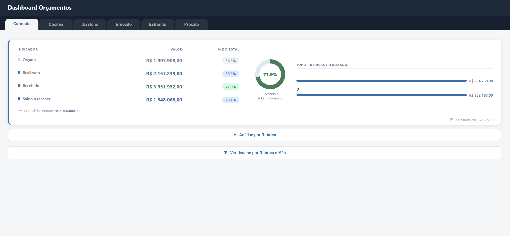

# Dashboard de Orçamentos

  

Aplicação web desenvolvida em Google Apps Script para acompanhamento financeiro de projetos a partir de dados do Google Sheets.

## Sobre o projeto
O sistema consolida informações de despesas e receitas por projeto, exibindo indicadores de valores orçados, realizados, recebidos e saldo a receber em uma interface interativa.

  

## Funcionalidades
- Resumo financeiro por projeto
- Visualização de top rubricas realizadas
- Detalhamento mensal por rubrica
- Análise gerencial com filtro por mês
- Edição de valores diretamente pela interface
- Registro automático da última atualização

  

## Tecnologias
- Google Apps Script
- HTML
- CSS
- JavaScript
- Google Sheets

## Estrutura dos dados
O app utiliza abas da planilha como fonte de dados:
- Despesa
- Receita
- Total_por_projeto

## Destaques técnicos
- Consolidação de múltiplas fontes em uma visão única por projeto
- Normalização de nomes e tratamento de valores monetários
- Persistência de alterações diretamente na planilha
- Controle de timestamp automático via gatilho de edição

## Melhorias futuras
- Filtros avançados por período
- Exportação de relatórios
- Controle de permissões por usuário
- Indicadores gráficos adicionais
